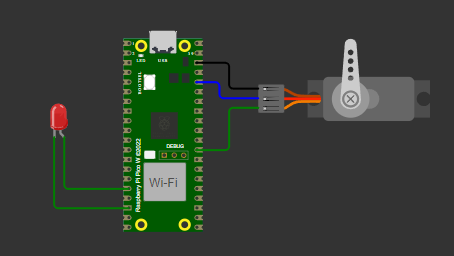

# Controle de servomotor por PWM

## Objetivo
Com o emprego  do módulo PWM (do inglês,  Pulse Width Modulation), presente  no  microcontrolador  RP2040,  projete  um  sistema  com  a  ferramenta Pico SDK para simular o controle do ângulo de um servomotor. Esta simulação contemplará o motor micro servo padrão, presente no simulador de eletrônica online Wokwi.

1. Microcontrolador Raspberry Pi Pico W. 
2. Servomotor – motor micro servo padrão – Wokwi. 

## Requisitos
.pdf)

## Demosntração
[Vídeo de Demonstração](https://drive.google.com/file/d/1F_IJ_R_YvVQPl_TdouoDFAhcukLlP2IB/view?usp=sharing)

## Circuito

## Como compilar
Para compilar o programa, utilize um compilador C, gerando os arquivos `.uf2` e `.elf`. Siga os passos abaixo:

1. Configure o ambiente de desenvolvimento para o Raspberry Pi Pico.
2. Compile o código utilizando um compilador compatível.

## Como executar
Após a compilação, execute o simulador Wokwi clicando no arquivo `diagram.json`:

Para testar, clique em "Play" no Wokwi e explore o circuito.

Para colocar na placa, clique em "compile" e em "run" com a placa conectada.

## Requisitos
- Compilador C (gcc ou equivalente).
- Sistema operacional compatível com programas C.
- Extensão Raspberry Pi Pico.
- Wokwi configurado no VS Code.
- Placa Raspberry Pi Pico - BitDogLab

## Desenvolvedora
- [Evelyn Suzarte](https://github.com/Evelynsuzarte)
